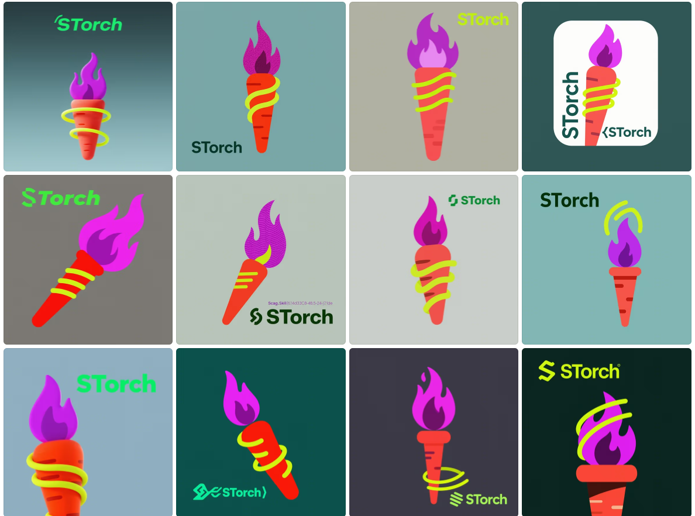
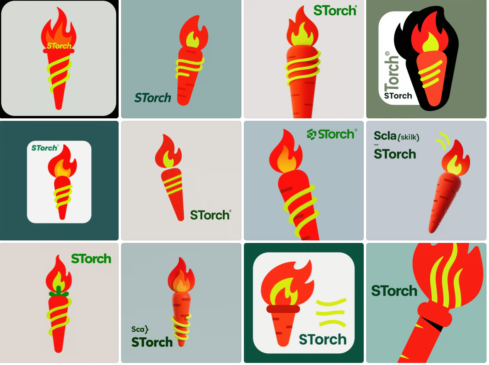
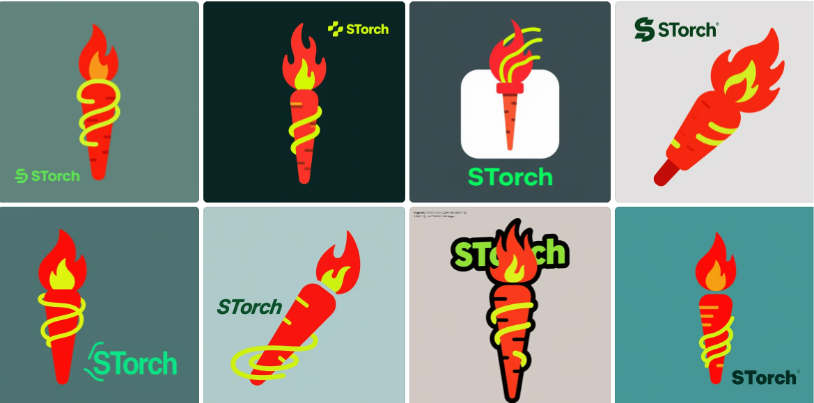

# STorch - GPU Accelerated Deep Learning for Scala 3

STorch is a Scala library for fast tensor computations and deep learning, based on PyTorch.
Base On Cpp LibTorch, STorch has equal position with Pytorch  
Like PyTorch, STorch provides
* A NumPy like API for working with tensors
* GPU support [Future will support HuaWei CANN NPU]
* Automatic differentiation
* A neural network API for building and training neural networks.
* What All you need Pytorch features could find in STorch !!!
* Minimal time and learning cost migrate from python pytorch developer
* Maximal ROI for Big Data developer and Data Scientist
* Support LLM | Recommend System | Compute Vision | NLP | Financial Tech | RL |Big Data | Data Science Research
* Big Deep Learning Environment Chains boost you concentrate on  development
* Support Java SMID Vector API, Please use JDK Version >= 17
* Could Use NCCL | GLOO | RAY | SPARK | FLINK for DISTRIBUTE TRAINING and inference [Future will support UCC | MPI] 
* Best Data Driven Process and Monad Feature Engineer Model Pipeline Partner for Apache Spark | Flink  | Polar

STorch aims to close to the Python API to make porting existing models and the life of people already familiar with PyTorch easier.

STorch Tutorial ,see here -> https://github.com/mullerhai/storch-tutorial







For documentation, see https://storch.dev

## Example:

```scala
val data = Seq(0,1,2,3)
// data: Seq[Int] = List(0, 1, 2, 3)
val t1 = torch.Tensor(data)
// t1: Tensor[Int32] = dtype=int32, shape=[4], device=CPU 
// [0, 1, 2, 3]
t1.equal(torch.arange(0,4))
// res0: Boolean = true
val t2 = t1.to(dtype=float32)
// t2: Tensor[Float32] = dtype=float32, shape=[4], device=CPU 
// [0,0000, 1,0000, 2,0000, 3,0000]
val t3 = t1 + t2
// t3: Tensor[Float32] = dtype=float32, shape=[4], device=CPU 
// [0,0000, 2,0000, 4,0000, 6,0000]

val shape = Seq(2l,3l)
// shape: Seq[Long] = List(2, 3)
val randTensor = torch.rand(shape)
// randTensor: Tensor[Float32] = dtype=float32, shape=[2, 3], device=CPU 
// [[0,4341, 0,9738, 0,9305],
//  [0,8987, 0,1122, 0,3912]]
val zerosTensor = torch.zeros(shape, dtype=torch.int64)
// zerosTensor: Tensor[Int64] = dtype=int64, shape=[2, 3], device=CPU 
// [[0, 0, 0],
//  [0, 0, 0]]

val x = torch.ones(Seq(5))
// x: Tensor[Float32] = dtype=float32, shape=[5], device=CPU 
// [1,0000, 1,0000, 1,0000, 1,0000, 1,0000]
val w = torch.randn(Seq(5, 3), requiresGrad=true)
// w: Tensor[Float32] = dtype=float32, shape=[5, 3], device=CPU 
// [[0,8975, 0,5484, 0,2307],
//  [0,2689, 0,7430, 0,6446],
//  [0,9503, 0,6342, 0,7523],
//  [0,5332, 0,7497, 0,3665],
//  [0,3376, 0,6040, 0,5033]]
val b = torch.randn(Seq(3), requiresGrad=true)
// b: Tensor[Float32] = dtype=float32, shape=[3], device=CPU 
// [0,2638, 0,9697, 0,3664]
val z = (x matmul w) + b
// z: Tensor[Float32] = dtype=float32, shape=[3], device=CPU 
// [3,2513, 4,2490, 2,8640]
```


